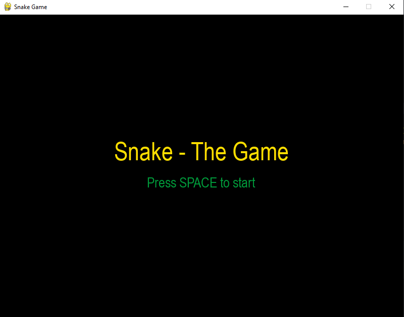
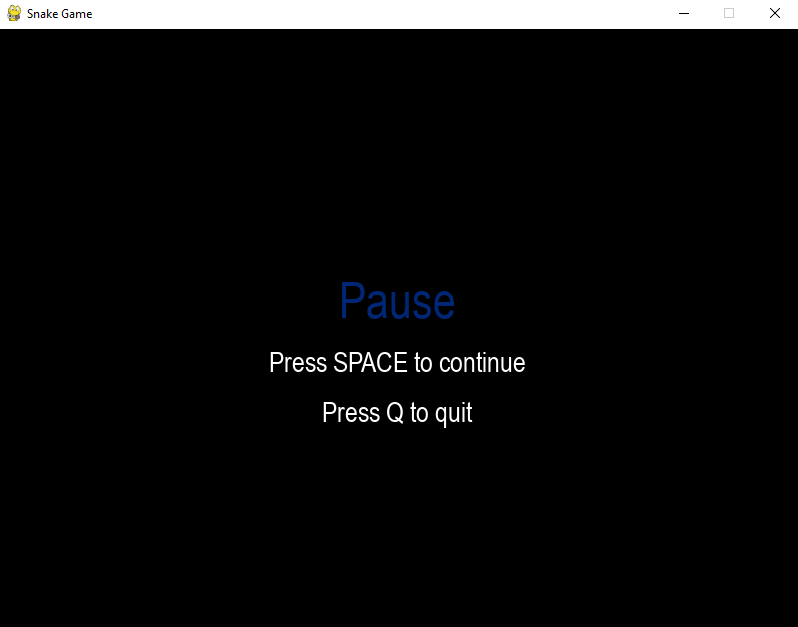
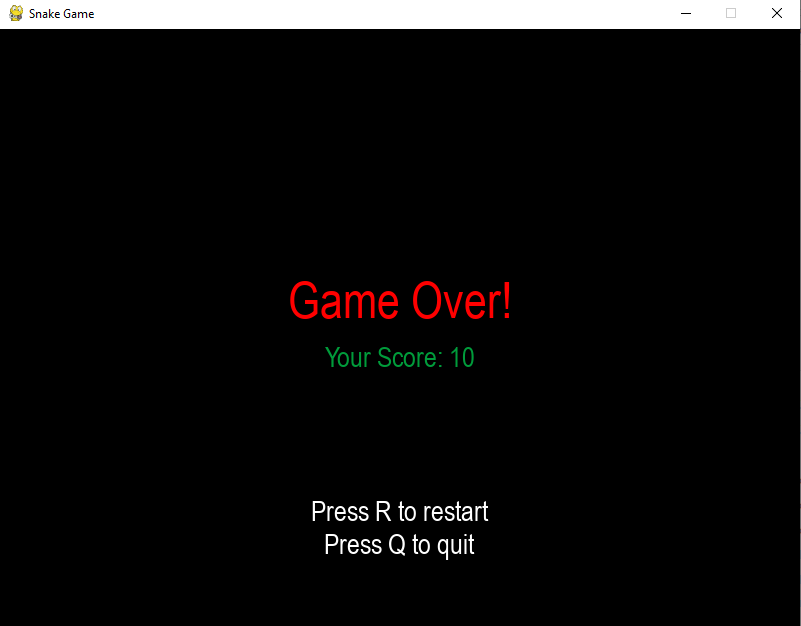

# Snake - The Game

This is a version of the classic Snake Game, all built with python.

## Table of contents

- [Overview](#overview)
  - [Screenshot](#screenshot)
  - [Built with](#built-with)
  - [Useful resources](#useful-resources)
- [Author](#author)

## Overview

Snake, the game that was popularized in 1998, has countless versions, but I decided to biuld my own using python, and here it is.

### Screenshot

## My process

### Built with

This game was made using [pygame](https://www.pygame.org/news), a python framework used (as the name suggests) to build games.

### Useful resources

- [Pygame Documentation](https://www.pygame.org/docs/ref/pygame.html) - Here is everything you need to use pygame

## Author

- Frontend Mentor - [@itsale-o](https://www.frontendmentor.io/profile/itsale-o)
- LinkedIn - [alessandra-santos-oliveira](https://www.linkedin.com/in/alessandra-santos-oliveira/)
- Twitter - [@itsale_o](https://www.twitter.com/itsale_o)
